# Physics in Python

This repository contains physics demos, based on 
[_testable_](https://medium.com/ns-techblog/tdd-or-how-i-learned-to-stop-worrying-and-love-writing-tests-ef7314470305) code! 
The graphics library used is [VPython](https://vpython.org/).

- [**`src`**](src) &rarr; contains the sources
- [**`test`**](test) &rarr; the tests of the components in the generic toolbox

# Physics demos [on glowscript.org](https://glowscript.org/#/user/zeger.hendrikse/) and [on trinket.io](https://trinket.io/)

#### **&darr;** Click on the below images to see animated versions **&darr;**

## Electromagnetism

The code pertaining to the demos in this section is available under the 
[electromagnetism tab](https://glowscript.org/#/user/zeger.hendrikse/folder/Electromagnetism/)
tab on [glowscript.org](https://glowscript.org).

### Electric field of a dipole

This code visualizes the electric field around a dipole. You may zoom in at any point 
by click the mouse.

- Code in action [on Trinket](https://zegerh-6085.trinket.io/sites/dipole) 
- Code in action [on glowscript.org](https://glowscript.org/#/user/zeger.hendrikse/folder/Electromagnetism/program/Electricdipolefield)
- Code base [on Trinket](https://trinket.io/glowscript/a2b8b655fa07)

### Electric field of point charge]

This code visualizes the electric field around a dipole. You may zoom in at any point 
by click the mouse.

[Electric field of point charge]()

- Code in action [on Trinket](https://zegerh-6085.trinket.io/sites/point_charge) 
- Code in action [on glowscript.org](https://glowscript.org/#/user/zeger.hendrikse/folder/Electromagnetism/program/Pointchargefield)
- Code base [on Trinket](https://trinket.io/glowscript/96da4eb68335)

### Visualizing [electromagnetic waves](https://trinket.io/library/trinkets/b8d62b38e852)

<a href="https://zegerh-6085.trinket.io/sites/electromagnetic_wave">
  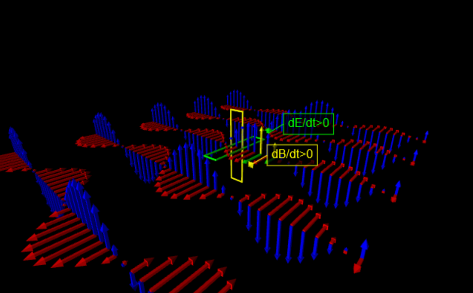 
</a>

### [Charged particle moving through electric field](https://trinket.io/glowscript/db4616ccd73c)

<a href="https://zegerh-6085.trinket.io/sites/moving_charge">
   
</a>

### [Faraday's law](https://trinket.io/library/trinkets/d3934e117c2e) interactive visualization

<a href="https://zegerh-6085.trinket.io/sites/faradays_law">
  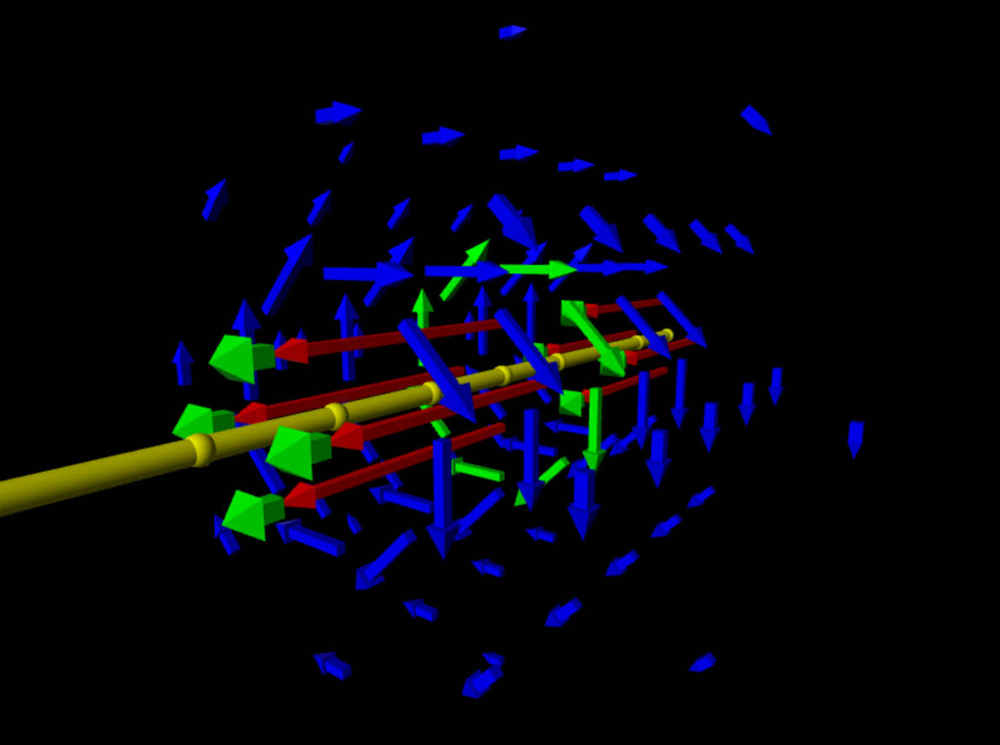
</a>

### [Electron spinning around charged ring](https://trinket.io/library/trinkets/1983b9c1dc58)

<a href="https://zegerh-6085.trinket.io/sites/electron_and_charged_ring">
  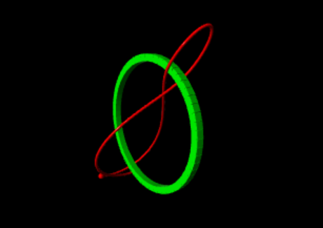
</a>

## Special relativity &mdash; space-time visualization

### [Galilean space-time](https://trinket.io/library/trinkets/6499b8e78c27)

<a href="https://zegerh-6085.trinket.io/sites/galileo_space_time">
  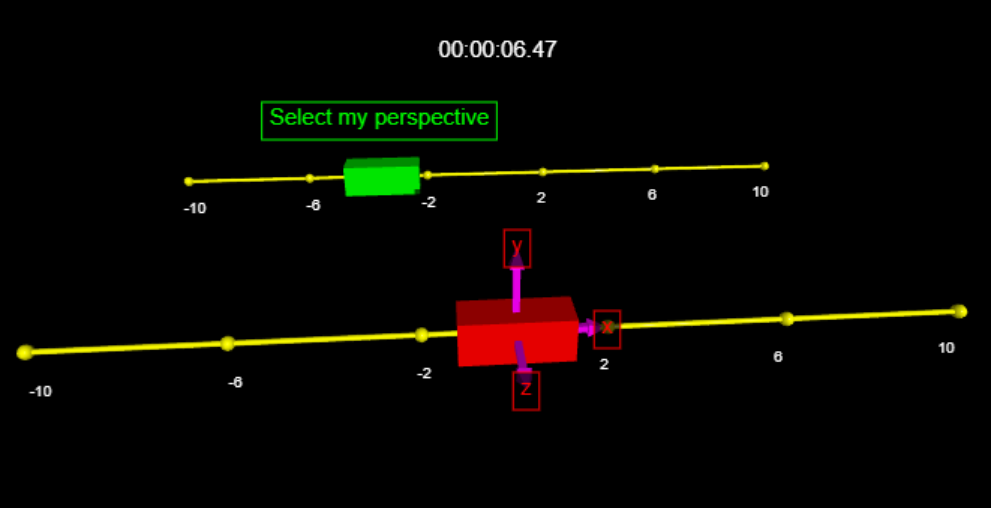
</a>

### Coming soon: Minkowski space-time

This is currently under construction

## Thermodynamics

The code pertaining to the demos in this section is available under the 
[thermodynamics tab](https://glowscript.org/#/user/zeger.hendrikse/folder/Thermodynamics/)
tab on [glowscript.org](https://glowscript.org).

### Visualizing a hard sphere gas model

This model represents a Boltzmann gas (consisting of hard spheres) in a box, where 
the velocity distribution of the colliding atoms eventually approaches the calculated 
theoretical velocity distribution.

<a href="https://glowscript.org/#/user/zeger.hendrikse/folder/Thermodynamics/program/Hardspheregas">
  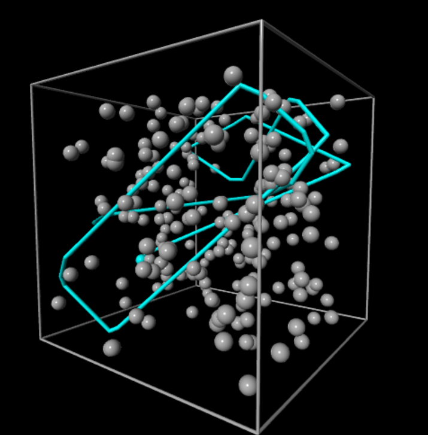
</a>

- Code in action [on Trinket](https://zegerh-6085.trinket.io/sites/hard_sphere_gas) 
- Code in action [on glowscript.org](https://glowscript.org/#/user/zeger.hendrikse/folder/Thermodynamics/program/Hardspheregas)
- Code base [on Trinket](https://trinket.io/library/trinkets/554248a15bc4)

### Two-dimensional Ising spin model

This demo models the magnetization at various temperatures using a two-dimensional Ising spin lattice.

<a href="https://glowscript.org/#/user/zeger.hendrikse/folder/Thermodynamics/program/Isingspin">
  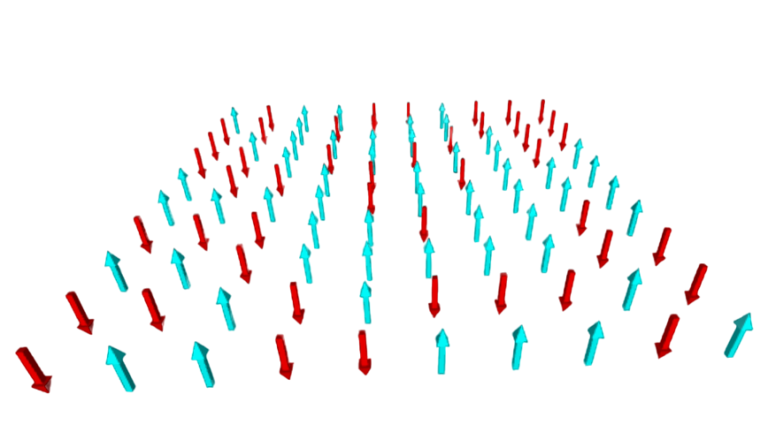
</a>

- Code in action [on Trinket](https://zegerh-6085.trinket.io/sites/ising_spin_model) 
- Code in action [on glowscript.org](https://glowscript.org/#/user/zeger.hendrikse/folder/Thermodynamics/program/Isingspin)
- Code base [on Trinket](https://trinket.io/library/trinkets/07404ee90b64)

## Kinematics

### [N-body coupled oscillator](https://trinket.io/glowscript/5a852a2b7570)

### [Kepler's laws](https://trinket.io/library/trinkets/11c6cd8b5622) of equal areas

<a href="https://zegerh-6085.trinket.io/sites/keplers_law">
  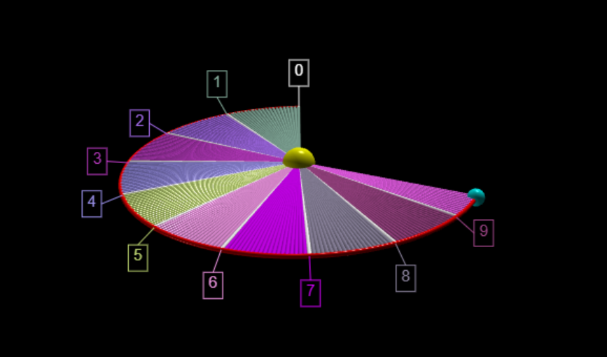
</a>

### [Doppler effect](https://trinket.io/library/trinkets/9d869c1167ec)

<a href="https://zegerh-6085.trinket.io/sites/doppler_effect">
  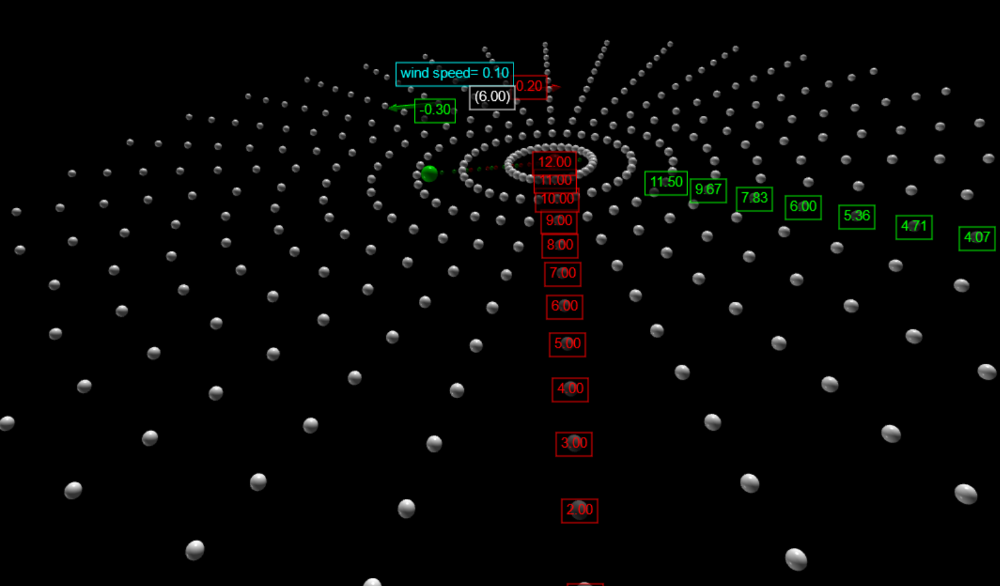
</a>

### [Newton&apos;s pendulum](https://trinket.io/glowscript/1b74de8aeee8)

### [Ball on sliding ramp](https://trinket.io/library/trinkets/0731c4e734f8)

<a href="https://zegerh-6085.trinket.io/sites/ball_on_sliding_ramp">
  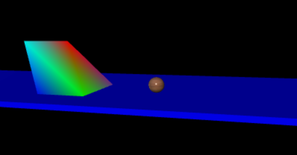
</a>

### [Harmonic oscillator](https://trinket.io/library/trinkets/e80e37600b06)

### [Ball hitting block](https://trinket.io/library/trinkets/0e414ca766d1)

### [Floating block](https://trinket.io/library/trinkets/94ed363f8b25)
<a href="https://zegerh-6085.trinket.io/sites/floating_block">
  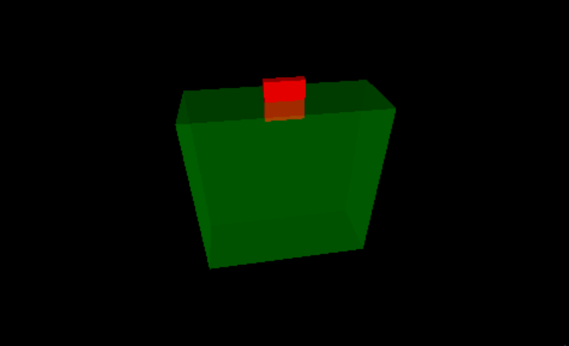
</a>

## Glowscript demos from [Dot Physics](https://www.youtube.com/channel/UCVxIDFY01y4n_c2lK1TB-KA)

These demos are _refactored versions_ of the originals, found 
by the followling hyperlinks below. I have tried to make the
original code more object-oriented and make it [reveal its intent](https://martinfowler.com/bliki/BeckDesignRules.html).

### Water Sprinkler

- See [my code in action](https://trinket.io/glowscript/3ec01917098d) on Trinket
- Based on the original [water sprinkler](https://rhettallain.com/2019/11/12/modeling-a-spinning-sprinkler/) blog post and the code presented therein

### Elastic collision

- See [my code in action](https://trinket.io/glowscript/d7600bd4705a) on Trinket
- Based on the original [elastic collision](https://www.youtube.com/watch?v=g_p-5YfUSnw&t=11s) video and the code presented therein

### Chain falling from table

- See [my code in action](https://trinket.io/glowscript/c3e556761469) on Trinket
- Based on the original [chain falling from table](https://www.youtube.com/watch?v=vXp1hW_t-bo) video and the code presented therein

### Ball falling on spring

- See [my code in action](https://trinket.io/glowscript/92ffad53ab4d) on Trinket
- Based on the original [ball falling on spring](https://www.youtube.com/watch?v=ExxDuRTIe0E) video and the code presented therein

### Three-body problem

- See [my code in action](https://trinket.io/glowscript/42acc05540ae) on Trinket
- Based on the original [three-body problem](https://www.youtube.com/watch?v=Ye2wIV8-SB8) video and the code presented therein

### Earth-moon orbit

- See [my code in action](https://trinket.io/glowscript/42acc05540ae) on Trinket
- Based on the original [earth-moon system](https://www.youtube.com/watch?v=2BisyQhNBFM) video and the code presented therein

### Slinky drop

<a href="https://zegerh-6085.trinket.io/sites/slinkydrop">
  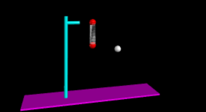
</a>

- See [my code in action](https://trinket.io/library/trinkets/9c6757b113dc) on Trinket
- Based on the original [slinky drop](https://rhettallain.com/2019/02/06/modeling-a-falling-slinky/) blog post and [the code presented therein](https://trinket.io/glowscript/e5f14ebee1)

# Fun stuff with [VPython](https://vpython.org/) 

### [Rubik's cube](https://trinket.io/library/trinkets/00eb13fbcd14)

<a href="https://zegerh-6085.trinket.io/sites/rubiks_cube">
  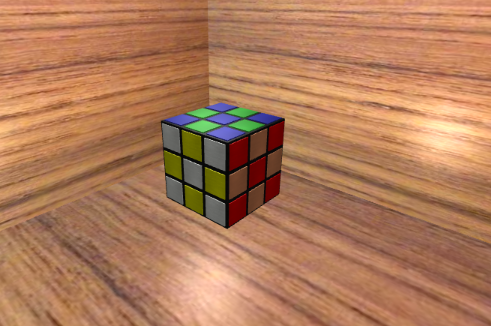
</a>

### [Turtle graphics robot](https://trinket.io/library/trinkets/31a188264ef1)

<a href="https://zegerh-6085.trinket.io/sites/vturtle">
  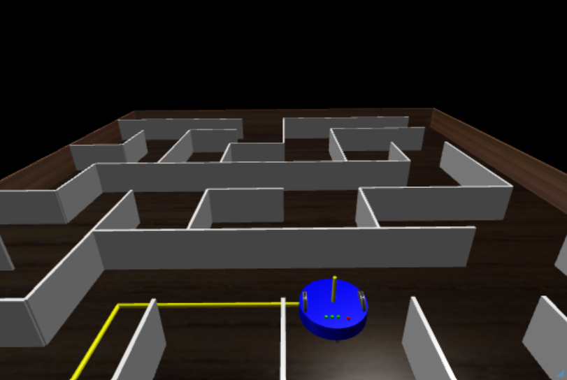
</a>

# References

- [MyScript](https://webdemo.myscript.com/): enter text, equations, or diagrams by hand, and effortlessly convert it to MathML, LaTeX, etc!

- Just for fun: [online electric circuit construction kit](https://phet.colorado.edu/sims/html/circuit-construction-kit-ac/latest/circuit-construction-kit-ac_all.html).
Make sure to check it out, it simply is brilliant.

- [Manim](https://github.com/3b1b/manim), an animation engine for explanatory math videos

## VPython

- [Physics through Glowscript - An introductory course](https://bphilhour.trinket.io/physics-through-glowscript-an-introductory-course), an excellent tutorial!

- [3D Modeling with VPython](https://rsehosting.reading.ac.uk/courses/py3d-basic/)

- [VPython Applications for Teaching Physics](https://www.visualrelativity.com/vpython/)

- [Programs by Bob Salgado](https://www.glowscript.org/#/user/Rob_Salgado/folder/My_Programs/)

- [VPython Docs](https://www.beautifulmathuncensored.de/static/GlowScript/VPythonDocs/)

- [Glowscript documentation](https://www.glowscript.org/docs/VPythonDocs/index.html)
