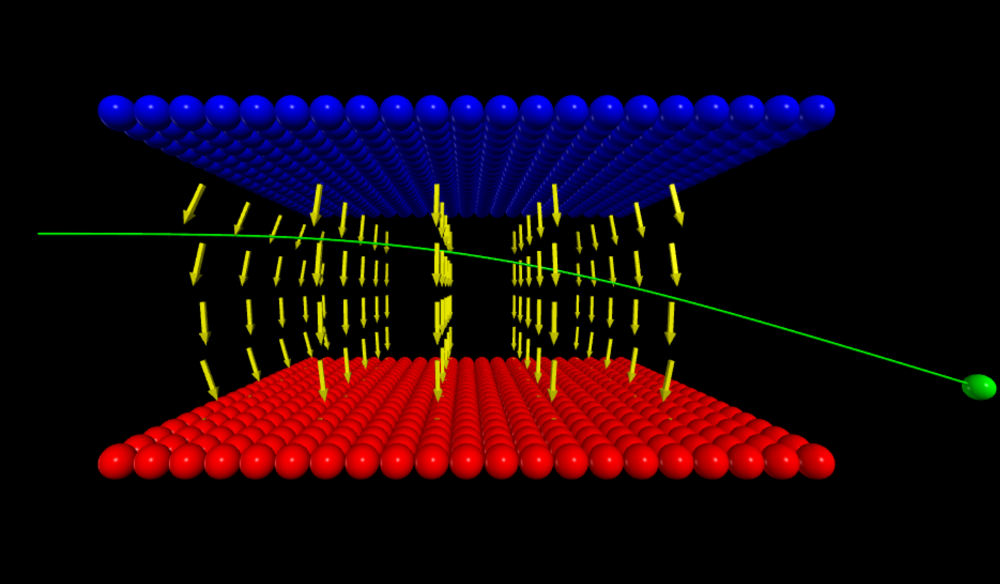
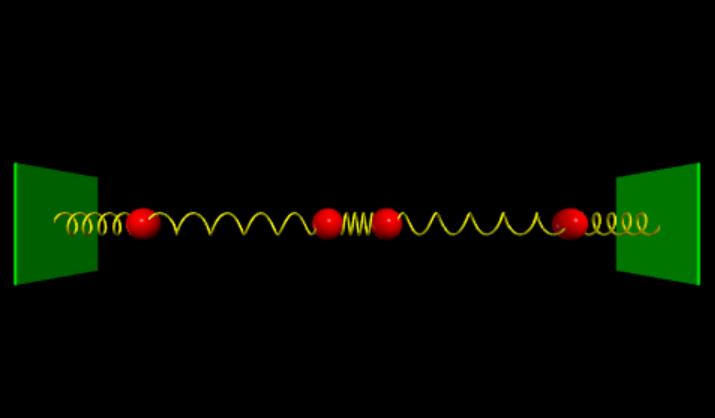
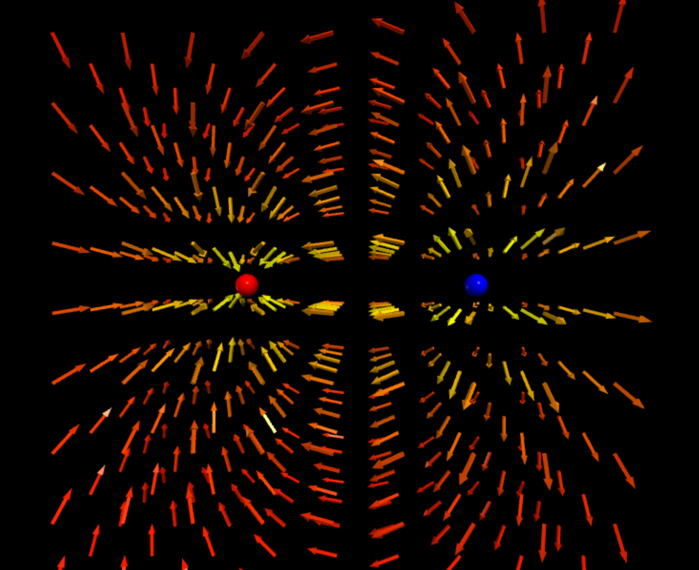
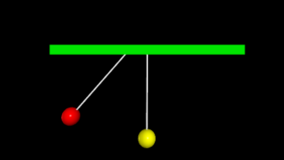
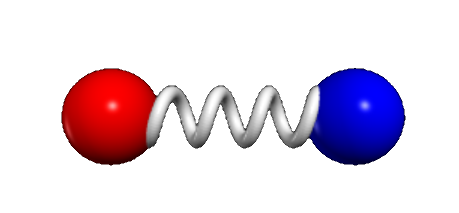

# Physics in Python

This repository contains physics demos, mainly using [VPython](https://vpython.org/).

- [**`src`**](src) &rarr; contains the sources
- [**`test`**](test) &rarr; the tests of the components in the generic toolbox

## [Glowscript](https://www.glowscript.org/) demos on [Trinket](https://trinket.io)

#### **&darr;** Click on the below images to see animated versions **&darr;**

### [Charged particle moving through electric field](https://trinket.io/glowscript/db4616ccd73c)

<a href="https://zegerh-6085.trinket.io/sites/moving_charge">
   
</a>

### [N-body coupled oscillator](https://trinket.io/glowscript/5a852a2b7570)

### [Electric field of point charge](https://trinket.io/glowscript/96da4eb68335)

### [Electric dipole field](https://trinket.io/glowscript/a2b8b655fa07)

### [Newton&apos;s pendulum](https://trinket.io/glowscript/1b74de8aeee8)

### [Harmonic oscillator](https://trinket.io/library/trinkets/e80e37600b06)

## Glowscript demos from [Dot Physics](https://www.youtube.com/channel/UCVxIDFY01y4n_c2lK1TB-KA)

These demos are _refactored versions_ of the originals, found 
by the followling hyperlinks below. I have tried to make the
original code more object-oriented and make it [reveal its intent](https://martinfowler.com/bliki/BeckDesignRules.html).

### Water Sprinkler

- See [my code in action](https://trinket.io/glowscript/3ec01917098d) on Trinket
- Based on the original [water sprinkler](https://rhettallain.com/2019/11/12/modeling-a-spinning-sprinkler/) blog post and the code presented therein

### Elastic collision

- See [my code in action](https://trinket.io/glowscript/d7600bd4705a) on Trinket
- Based on the original [elastic collision](https://www.youtube.com/watch?v=g_p-5YfUSnw&t=11s) video and the code presented therein

### Chain falling from table

- See [my code in action](https://trinket.io/glowscript/c3e556761469) on Trinket
- Based on the original [chain falling from table](https://www.youtube.com/watch?v=vXp1hW_t-bo) video and the code presented therein

### Ball falling on spring

- See [my code in action](https://trinket.io/glowscript/92ffad53ab4d) on Trinket
- Based on the original [ball falling on spring](https://www.youtube.com/watch?v=ExxDuRTIe0E) video and the code presented therein

### Three-body problem

- See [my code in action](https://trinket.io/glowscript/42acc05540ae) on Trinket
- Based on the original [three-body problem](https://www.youtube.com/watch?v=Ye2wIV8-SB8) video and the code presented therein

### Earth-moon orbit

- See [my code in action](https://trinket.io/glowscript/42acc05540ae) on Trinket
- Based on the original [earth-moon system]([https://www.youtube.com/watch?v=ExxDuRTIe0E](https://www.youtube.com/watch?v=2BisyQhNBFM)) video and the code presented therein

# References

- [MyScript](https://webdemo.myscript.com/): enter text, equations, or diagrams by hand, and effortlessly convert it to MathML, LaTeX, etc!

- Just for fun: [online electric circuit construction kit](https://phet.colorado.edu/sims/html/circuit-construction-kit-ac/latest/circuit-construction-kit-ac_all.html).
Make sure to check it out, it simply is brilliant.

- [Manim](https://github.com/3b1b/manim), an animation engine for explanatory math videos
