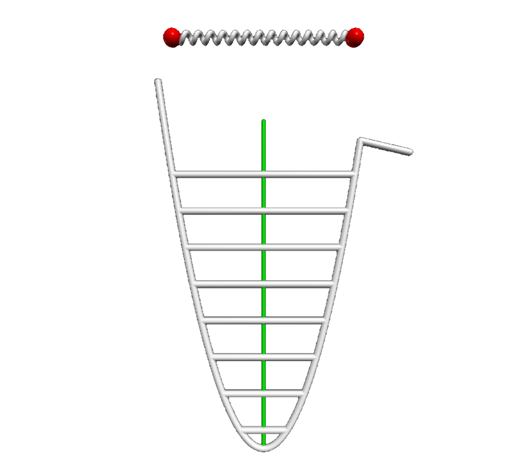
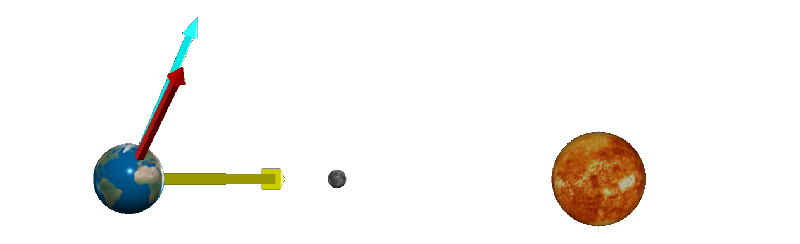
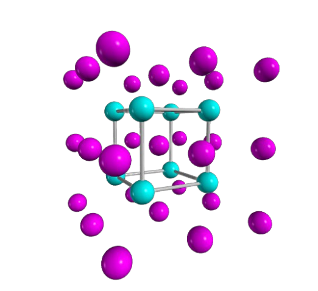
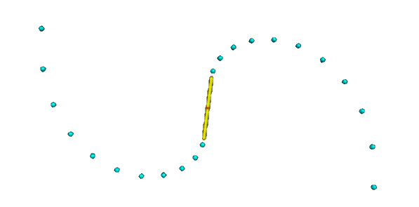

# Physics in Python &mdash; introduction

This repository contains physics demos, based on 
[_testable_](https://medium.com/ns-techblog/tdd-or-how-i-learned-to-stop-worrying-and-love-writing-tests-ef7314470305) code! 
The graphics library used is [VPython](https://vpython.org/).

All animations can be viewed on [my glowscript.org](https://glowscript.org/#/user/zeger.hendrikse/) page.

### Repository contents

- [**`src`**](src) &rarr; contains the sources
- [**`test`**](test) &rarr; the tests of the components in the generic toolbox

# Thermodynamics

The code pertaining to the demos in this section is available under the 
[thermodynamics tab](https://glowscript.org/#/user/zeger.hendrikse/folder/Thermodynamics/)
on [glowscript.org](https://glowscript.org).

## Visualizing a hard sphere gas model

This model represents a Boltzmann gas (consisting of hard spheres) in a box. The velocity distribution of the colliding atoms eventually approaches the calculated 
theoretical velocity distribution:

$f(\vec{v}) d^3\vec{v} = \bigg [ \dfrac{m}{2\pi k_b T} \bigg ]^{3/2} \exp \bigg (-\dfrac{mv^2}{2 k_b T} \bigg) d^3\vec{v}$

<figure>
  
</figure>

  
Animations and source code

  <ul>
    <ul><b>Ideal gas</b>
        <li>See live animations <a href="https://zegerh-6085.trinket.io/sites/hard_sphere_gas">on Trinket</a> and <a href="https://glowscript.org/#/user/zeger.hendrikse/folder/Thermodynamics/program/Hardspheregas">glowscript.org</a></li>
        <li>Glowscript <a href="./src/glowscript/thermodynamics/hard_sphere_gas.py">hard_sphere_gas.py</a> and VPython <a href="./src/thermodynamics/hard_sphere_gas.py">hard_sphere_gas.py</a> versions in this repository</li>
    </ul>
  </ul>

## Two-dimensional Ising spin model: 

This demo models the magnetization at various temperatures using a two-dimensional Ising spin lattice.

<figure>
  
</figure>

  
Animations and source code

  <ul>
    <ul><b>Ising spin model</b>
        <li>See live animations <a href="https://zegerh-6085.trinket.io/sites/ising_spin_model">on Trinket</a> and <a href="https://glowscript.org/#/user/zeger.hendrikse/folder/Thermodynamics/program/Isingspin">glowscript.org</a></li>
        <li>Glowscript <a href="./src/glowscript/thermodynamics/ising_spin.py">ising_spin.py</a> and VPython <a href="./src/thermodynamics/ising_spin.py">ising_spin.py</a> versions in this repository</li>
    </ul>
  </ul>

# Quantum &amp; wave mechanics

The code pertaining to the demos in this section is available under the 
[quantum tab](https://glowscript.org/#/user/zeger.hendrikse/folder/Quantum/)
on [glowscript.org](https://glowscript.org).

## Visualization of plane waves $\psi(x, t) = A \cdot e^{i(k x - \omega t)}$

With the plane wave as illustrated above, we can easily derive the Schr&#246;dinger equation:

  
Concise derivation of the Schr&#246;dinger equation

According to [De Broglie](https://en.wikipedia.org/wiki/Matter_wave) we have:

$p = \dfrac{h}{\lambda} = \dfrac{h}{2\pi} \dfrac{2\pi}{\lambda} = \hbar k \Rightarrow \hbar k = \hbar \dfrac{\partial}{\partial x} \psi(x,t) = p \psi(x, t) \Rightarrow p = \hbar \dfrac{\partial}{\partial x}$

The Kinetic energy can be expressed as:

$K = \dfrac{p^2}{2m} = -\dfrac{\hbar^2}{2m}\dfrac{\partial^2}{\partial x^2} \psi(x,t)$

The total energy is given by the [Planck-Einstein relation](https://en.wikipedia.org/wiki/Planck_relation):

$E = hf = \dfrac{h}{2\pi}\dfrac{2\pi}{T} = \hbar \omega \Rightarrow -i\hbar\dfrac{\partial}{\partial t} \psi(x,t) = E \psi(x,t) \Rightarrow E = -i\hbar\dfrac{\partial}{\partial t}$

From this we arrive at the [Schr&#246;dinger equation](https://en.wikipedia.org/wiki/Schr%C3%B6dinger_equation):

$(KE + PE)\Psi(x,,t) = E\Psi(x,t) = -i\hbar \dfrac{\partial}{\partial t}\Psi(x, t) = -\dfrac{\hbar^2}{2m}\dfrac{\partial^2}{\partial x^2} \Psi(x,t) + V(x)\Psi(x,t)$

  
Animations and source code

  <ul>
    <ul><b>Plane wave</b>
        <li>See live animations <a href="https://zegerh-6085.trinket.io/sites/plane_wave">on Trinket</a> and <a href="https://www.glowscript.org/#/user/zeger.hendrikse/folder/Quantum/program/Planewave">glowscript.org</a></li>
        <li>Glowscript <a href="./src/glowscript/quantum_and_waves/plane_wave.py">plane_wave.py</a> and VPython <a href="./src/quantum_and_waves/plane_wave.py">plane_wave.py</a> versions in this repository</li>
    </ul>
  </ul>

## One-dimensional quantum particle bound by an infinite square well

  
Animations and source code

  <ul>
    <ul><b>Plane wave</b>
        <li>See live animations <a href="https://zegerh-6085.trinket.io/sites/infinite_square_well">on Trinket</a> and <a href="https://www.glowscript.org/#/user/zeger.hendrikse/folder/Quantum/program/Infinitesquarewell">glowscript.org</a></li>
        <li>Glowscript <a href="./src/glowscript/quantum_and_waves/infinite_square_well.py">infinite_square_well.py</a> and VPython <a href="./src/quantum_and_waves/infinite_square_well.py">infinite_square_well.py</a> versions in this repository</li>
    </ul>
  </ul>

## Doppler effect

- Doppler effect in action [on Trinket](https://zegerh-6085.trinket.io/sites/doppler_effect) 
  and in action [on glowscript.org](https://www.glowscript.org/#/user/zeger.hendrikse/folder/Quantum/program/Dopplereffect)
- The code base [on Trinket](https://trinket.io/library/trinkets/9d869c1167ec)

## The quantum harmonic oscillator

The quantum harmonic oscillator is visualized in a semi-classical way below.

- Quantum oscillator in action [on Trinket](https://zegerh-6085.trinket.io/sites/quantum_oscillator) 
  and in action [on glowscript.org](https://www.glowscript.org/#/user/zeger.hendrikse/folder/Quantum/program/Quantumoscillator)
- Quantum oscillator code base [on Trinket](https://trinket.io/library/trinkets/555f7535fe74)

# Astrophysics

The code pertaining to the demos in this section is available under the 
[astrophysics tab](https://glowscript.org/#/user/zeger.hendrikse/folder/Astrophysics/)
on [glowscript.org](https://glowscript.org).

##  Kepler's law of equal areas

A dynamic visualization of Kepler's laws.

- Code in action [on Trinket](https://zegerh-6085.trinket.io/sites/keplers_law) 
  and in action [on glowscript.org](https://glowscript.org/#/user/zeger.hendrikse/folder/Astrophysics/program/Keplerslaw)
- Code base [on Trinket](https://trinket.io/library/trinkets/11c6cd8b5622)

## Daylight variations &mdash; sun-earth-moon model

A not accurate to scale sun-earth-moon model, but very detailed and instructive nonetheless! It shows the per day
incoming energy from the sun (at a given latitude), as well as the variations in the length of
the days per season. By clicking on the sun or earth, the camera perspective can be changed as well!

&nbsp;&nbsp;&nbsp;&nbsp;&nbsp;&nbsp;&nbsp;&nbsp;&nbsp;&nbsp;&nbsp;&nbsp;&nbsp;&nbsp;&nbsp;&nbsp;&nbsp;

- Code in action [on Trinket](https://zegerh-6085.trinket.io/sites/daylight_variations) 
  and in action [on glowscript.org](https://glowscript.org/#/user/zeger.hendrikse/folder/Astrophysics/program/Daylightvariations)
- Code base [on Trinket](https://trinket.io/library/trinkets/d218d43e551a)

# Electromagnetism

The code pertaining to the demos in this section is available under the 
[electromagnetism tab](https://glowscript.org/#/user/zeger.hendrikse/folder/Electromagnetism/)
on [glowscript.org](https://glowscript.org).

## Electric fields of dipoles and point charges

  
Visualization of electric fields around dipoles and point charges

For dipoles the field is given by

$\vec{E} ( \vec{r} ) = \dfrac {1} {4\pi\epsilon_0} \dfrac {Q} {r^2} \hat{r}, \text{ with } \vec{F}(\vec{r}) = q \vec{E} (\vec{r}) = \dfrac {1} {4\pi\epsilon_{0}} \dfrac {qQ} {r^2}\hat{r} \text{ }$

and for point charges by

$\vec{E} ( \vec{r} ) = -\dfrac {1} {4\pi\epsilon_0} \nabla \bigg( \dfrac{\vec{r}  \cdot \vec{p}} {r^3} \bigg), \text{ where } \vec{p} = +q(\vec{r_{+}}) + -q(\vec{r_{-})}$

  
Animations and source code

  <ul>
    <ul><b>Point charge</b>
        <li>See live animations <a href="https://zegerh-6085.trinket.io/sites/point_charge">on Trinket</a> and <a href="https://glowscript.org/#/user/zeger.hendrikse/folder/Electromagnetism/program/Pointchargefield">glowscript.org</a></li>
        <li>Glowscript <a href="./src/glowscript/electromagnetism/point_charge.py">point_charge.py</a> and VPython <a href="./src/electromagnetism/point_charge.py">point_charge.py</a> versions in this repository</li>
    </ul>
  </ul>
  <ul>
    <ul><b>Dipole</b>
        <li>See live animations <a href="https://zegerh-6085.trinket.io/sites/dipole">on Trinket</a> and <a href="https://glowscript.org/#/user/zeger.hendrikse/folder/Electromagnetism/program/Pointchargefield">glowscript.org</a></li>
        <li>Glowscript <a href="./src/glowscript/electromagnetism/dipole.py">point_charge.py</a> and VPython <a href="./src/electromagnetism/dipole.py">point_charge.py</a> versions in this repository</li>
    </ul>
  </ul>

<figure>
  
  
</figure>

## Interactive visualization of electric and magnetic fields

Visualization of Faraday's law by running an electric current (of electric charges) through a wire and of
an electric field inside a series of charged rings.

  
Animations and source code

  <ul>
    <ul><b>Faraday's law</b>
        <li>See live animations <a href="https://zegerh-6085.trinket.io/sites/faradays_law">on Trinket</a> and <a href="https://glowscript.org/#/user/zeger.hendrikse/folder/Electromagnetism/program/Faradayslaw">glowscript.org</a></li>
        <li>Glowscript <a href="./src/glowscript/electromagnetism/faradays_law.py">faradays_law.py</a> and VPython <a href="./src/electromagnetism/faradays_law.py">faradays_law.py</a> versions in this repository</li>
    </ul>
    <ul><b>Field inside charged rings</b>
        <li>See live animations <a href="https://zegerh-6085.trinket.io/sites/charged_rings">on Trinket</a> and <a href="https://glowscript.org/#/user/zeger.hendrikse/folder/Electromagnetism/program/Chargedrings">glowscript.org</a></li>
        <li>Glowscript <a href="./src/glowscript/electromagnetism/charged_rings.py">charged_rings.py</a> and VPython <a href="./src/electromagnetism/charged_rings.py">charged_rings.py</a> versions in this repository</li>
    </ul>
  </ul>

<figure>
  
    
</figure>

## Electron moving in two electric fields

The following demos show the movement of an electron in two different electric fields. 

  
Animations and source code

  <ul>
    <ul><b>Electron spinning around a charged ring</b>
        <li>See live animations <a href="https://zegerh-6085.trinket.io/sites/electron_and_charged_ring">on Trinket</a> and <a href="https://glowscript.org/#/user/zeger.hendrikse/folder/Electromagnetism/program/Chargedring">glowscript.org</a></li>
        <li>Glowscript <a href="./src/glowscript/electromagnetism/charged_ring.py">charged_ring.py</a> and VPython <a href="./src/electromagnetism/charged_ring.py">charged_ring.py</a> versions in this repository</li>
    </ul>
    <ul><b>Moving charge between two charged capacitor plates</b>
        <li>See live animations <a href="https://zegerh-6085.trinket.io/sites/moving_charge">on Trinket</a> and <a href="https://glowscript.org/#/user/zeger.hendrikse/folder/Electromagnetism/program/Movingcharge">glowscript.org</a></li>
        <li>Glowscript <a href="./src/glowscript/electromagnetism/moving_charge.py">moving_charge.py</a> and VPython <a href="./src/electromagnetism/moving_charge.py">moving_charge.py</a> versions in this repository</li>
    </ul>
  </ul>

<figure>
  
  
</figure>

## Charged disk and accompanying builder

Two rather simple demos that show the electric field around a disk. The builder allows a step-by-step
set-up of the disk by adding a charged ring at each mouse click.

<figure>
  
  
</figure>

  
Animations and source code

  <ul>
    <ul><b>Charged disk</b>
        <li>See live animations <a href="https://zegerh-6085.trinket.io/sites/charged_disk">on Trinket</a> and <a href="https://glowscript.org/#/user/zeger.hendrikse/folder/Electromagnetism/program/Chargeddisk">glowscript.org</a></li>
        <li>Glowscript <a href="./src/glowscript/electromagnetism/charged_disk.py">charged_disk.py</a> and VPython <a href="./src/electromagnetism/charged_disk.py">charged_disk.py</a> versions in this repository</li>
    </ul>
    <ul><b>Charged disk builder</b>
        <li>See live animations <a href="https://zegerh-6085.trinket.io/sites/charged_disk_builder">on Trinket</a> and <a href="https://glowscript.org/#/user/zeger.hendrikse/folder/Electromagnetism/program/Chargeddiskbuilder">glowscript.org</a></li>
        <li>Glowscript <a href="./src/glowscript/electromagnetism/charged_disk_builder.py">charged_disk_builder.py</a> and VPython <a href="./src/electromagnetism/charged_disk_builder.py">charged_disk_builder.py</a> versions in this repository</li>
    </ul>
  </ul>

## Visualization of electromagnetic waves

Both of the two dynamic simulations below visualize the propagation of electromagnetic waves. In the first demo,
the electromagnetic waves emanate from an antenna, in the second they are propagating through a vacuum.

- Antenna in action [on Trinket](https://zegerh-6085.trinket.io/sites/antenna) 
  and in action [on glowscript.org](https://glowscript.org/#/user/zeger.hendrikse/folder/Electromagnetism/program/Antenna)
- Antenna code base [on Trinket](https://trinket.io/library/trinkets/32ca075649d6)

- Electromagnetic waves in action [on Trinket](https://zegerh-6085.trinket.io/sites/electromagnetic_wave)
  and in action [on glowscript.org](https://glowscript.org/#/user/zeger.hendrikse/folder/Electromagnetism/program/Electromagneticwave)
- Electromagnetic waves code [on Trinket](https://trinket.io/library/trinkets/b8d62b38e852)

## Symmetry planes within a cubic lattice

This simple visualization allows the viewer to alternate between some planes of symmetry within a cubic crystal.

- Code in action [on Trinket](https://zegerh-6085.trinket.io/sites/relativistic_proton) 
  and in action [on glowscript.org](https://glowscript.org/#/user/zeger.hendrikse/folder/Electromagnetism/program/Crystalsymmetryplanes)
- Code base [on Trinket](https://trinket.io/library/trinkets/78efbf3b2a97)

# Special relativity &mdash; space-time visualizations and more

The code pertaining to the demos in this section is available under the 
[relativity tab](https://glowscript.org/#/user/zeger.hendrikse/folder/Relativity/)
on [glowscript.org](https://glowscript.org).

## Lightcone animation and electric field of a fast moving proton

A three-dimensional lightcone is animated by simultaneously 
sending off both a photon and a spaceship from the origin.

The other code snippet visualizes an electric field of a
fast moving (relativistic) proton.

&nbsp;&nbsp;&nbsp;&nbsp;&nbsp;&nbsp;&nbsp;&nbsp;&nbsp;

- Moving proton in action [on Trinket](https://zegerh-6085.trinket.io/sites/relativistic_proton) 
  and in action [on glowscript.org](https://glowscript.org/#/user/zeger.hendrikse/folder/Relativity/program/Relativisticproton)
- Proton code base [on Trinket](https://trinket.io/library/trinkets/2aaad6e82cc4)

- Lightcone animation [on Trinket](https://zegerh-6085.trinket.io/sites/lightcone) 
  and in action [on glowscript.org](https://glowscript.org/#/user/zeger.hendrikse/folder/Relativity/program/Lightcone)
- Lightcocne code base [on Trinket](https://trinket.io/library/trinkets/2afb9d937b95)

## Galilean transformation of relative motions in Euclidean plane

Before diving into (special) relativity, let's first get acquainted with 
the so-called Galilean transformation.

- Code in action [on Trinket](https://zegerh-6085.trinket.io/sites/galileo_space_time) 
  and in action [on glowscript.org](https://glowscript.org/#/user/zeger.hendrikse/folder/Relativity/program/Glalileantransformation)
- Code base [on Trinket](https://trinket.io/library/trinkets/6499b8e78c27)

# Coming soon: Minkowski space-time

This is currently under construction

# Kinematics

The code pertaining to the demos in this section is available under the 
[kinematics tab](https://glowscript.org/#/user/zeger.hendrikse/folder/Kinematics/)
on [glowscript.org](https://glowscript.org).

## Fun with springs

The applications of a simple harmonic oscillator are almost endless. 
You may be surprised though to find out what happens when you drop such a simple harmonic oscillator!! 

- [Drop the ball](https://zegerh-6085.trinket.io/sites/slinkydrop) on Trinket
  or [on glowscript.org](https://glowscript.org/#/user/zeger.hendrikse/folder/Kinematics/program/Ballonspringdrop)
- View the code [on Trinket](https://trinket.io/glowscript/92ffad53ab4d) which is based on the
  original [ball falling on spring](https://www.youtube.com/watch?v=ExxDuRTIe0E) video and the code presented therein

- Observe [the slinky drop](https://zegerh-6085.trinket.io/sites/slinkydrop) on Trinket
  or [on glowscript.org](https://glowscript.org/#/user/zeger.hendrikse/folder/Kinematics/program/Slinkydrop)
- View the slinky drop code [on Trinket](https://trinket.io/library/trinkets/9c6757b113dc), which is
  based on the original [slinky drop](https://rhettallain.com/2019/02/06/modeling-a-falling-slinky/) blog post and [the code presented therein](https://trinket.io/glowscript/e5f14ebee1)

## The _N_-body coupled oscillator

The N-body coupled harmonic oscillator is composed of beads connected by springs.
This coupled harmonic oscillator here lets you play around with an arbitrary 
number of vibrating beads coupled by springs on both sides!

- N-body coupled oscillator code in action [on Trinket](https://zegerh-6085.trinket.io/sites/n_body_coupled_oscillator) 
  and in action [on glowscript.org](https://glowscript.org/#/user/zeger.hendrikse/folder/Kinematics/program/N-bodycoupledoscillator)
- N-body coupled oscillator code base [on Trinket](https://trinket.io/glowscript/5a852a2b7570)

## Newton&apos;s pendulum and cannonball

  
Animations and source code

  <ul>
    <ul><b>Newton's pendulum</b>
        <li>See live animations <a href="https://zegerh-6085.trinket.io/sites/newtons_pendulum">on Trinket</a> and <a href="https://glowscript.org/#/user/zeger.hendrikse/folder/Kinematics/program/Newtonspendulum">glowscript.org</a></li>
        <li>Glowscript <a href="./src/glowscript/kinematics/newtons_cannon.py">newtons_pendulum.py</a> and VPython <a href="./src/kinematics/newtons_pendulum.py">newtons_cannon.py</a> versions in this repository</li>
    </ul>
    <ul><b>Newton's cannonball</b>
        <li>See live animations <a href="https://zegerh-6085.trinket.io/sites/newtons_cannon">on Trinket</a> and <a href="https://glowscript.org/#/user/zeger.hendrikse/folder/Kinematics/program/Newtonscannon">glowscript.org</a></li>
        <li>Glowscript <a href="./src/glowscript/kinematics/charged_rings.py">newtons_cannon.py</a> and VPython <a href="./src/kinematics/newtons_cannon.py">charged_rings.py</a> versions in this repository</li>
    </ul>
  </ul>

<figure>
  
  
</figure>

## Ball on sliding ramp &amp; ball hitting block

 &nbsp;&nbsp;&nbsp;&nbsp;&nbsp;

- Rotating block in action [on Trinket](https://zegerh-6085.trinket.io/sites/block_rotation) 
  and in action [on glowscript.org](https://glowscript.org/#/user/zeger.hendrikse/folder/Kinematics/program/Blockrotation)
- Rotating block code base [on Trinket](https://trinket.io/library/trinkets/0e414ca766d1)

## Water sprinkler and floating block

Some animations that have something to do with water.

- Floating block in action [on Trinket](https://zegerh-6085.trinket.io/sites/floating_block) 
  and in action [on glowscript.org](https://glowscript.org/#/user/zeger.hendrikse/folder/Kinematics/program/Floatingblock)
- Floating block code base [on Trinket](https://trinket.io/library/trinkets/94ed363f8b25)

- See the water sprinkler in action [on Trinket](https://zegerh-6085.trinket.io/sites/sprinkler) 
  and on [glowscript.org](https://glowscript.org/#/user/zeger.hendrikse/folder/Kinematics/program/Watersprinkler)
- Take a look at [the code base](https://trinket.io/glowscript/3ec01917098d), which is 
  based on the original [water sprinkler](https://rhettallain.com/2019/11/12/modeling-a-spinning-sprinkler/) blog post and the code presented therein

# Miscellaneous

## Polar coordinates and flock of birds

An illustration of using polar (spherical) coordinates and a flock of birds

- Polar code in action [on Trinket](https://zegerh-6085.trinket.io/sites/polar_coordinates) 
  and in action [on glowscript.org](https://glowscript.org/#/user/zeger.hendrikse/folder/MyPrograms/program/Polarcoordinates)
- Polar coordinates code base [on Trinket](https://trinket.io/library/trinkets/d7fa526a8ee9)

- Flocking birds in action [on Trinket](https://zegerh-6085.trinket.io/sites/flocking_birds) 
  and in action [on glowscript.org](https://glowscript.org/#/user/zeger.hendrikse/folder/MyPrograms/program/Flockingbirds)
- Flocking birds code base [on Trinket](https://trinket.io/library/trinkets/54d12548d4ec)

## Elastic collision

- See [my code in action](https://trinket.io/glowscript/d7600bd4705a) on Trinket
- Based on the original [elastic collision](https://www.youtube.com/watch?v=g_p-5YfUSnw&t=11s) video and the code presented therein

## Chain falling from table

- See [my code in action](https://trinket.io/glowscript/c3e556761469) on Trinket
- Based on the original [chain falling from table](https://www.youtube.com/watch?v=vXp1hW_t-bo) video and the code presented therein

## Three-body problem

- See [my code in action](https://trinket.io/glowscript/42acc05540ae) on Trinket
- Based on the original [three-body problem](https://www.youtube.com/watch?v=Ye2wIV8-SB8) video and the code presented therein

## Earth-moon orbit

- See [my code in action](https://trinket.io/glowscript/42acc05540ae) on Trinket
- Based on the original [earth-moon system](https://www.youtube.com/watch?v=2BisyQhNBFM) video and the code presented therein

# Fun stuff with [VPython](https://vpython.org/) 

## [Rubik's cube](https://trinket.io/library/trinkets/00eb13fbcd14) and  [Turtle graphics robot](https://trinket.io/library/trinkets/31a188264ef1)

&nbsp;&nbsp;&nbsp;&nbsp;&nbsp;

## Odysseus

- Odysseus in action [on Trinket](https://zegerh-6085.trinket.io/sites/odysseus) 
  and in action [on glowscript.org](https://glowscript.org/#/user/zeger.hendrikse/folder/MyPrograms/program/Odysseus)
- Odysseus code base [on Trinket](https://trinket.io/library/trinkets/f3568325e563)

# Acknowledgements

- [Ruth Chabay and Bruce Sherwood](https://www.aapt.org/aboutaapt/Chabay_Sherwood_2014-Halliday-Resnick-Award.cfm)
- [Rhett Allain](https://en.wikipedia.org/wiki/Rhett_Allain)
- [Rob Salgado](https://www.linkedin.com/in/robertobsalgado)
- [Steve Spicklemire](https://github.com/sspickle)

# References

- Check this out &rarr; [QMsolve: A module for solving and visualizing the Schrödinger equation](https://github.com/quantum-visualizations/qmsolve)
- [MyScript](https://webdemo.myscript.com/): enter text, equations, or diagrams by hand, and effortlessly convert 
  it to MathML, LaTeX, etc.!
- Just for fun: [online electric circuit construction kit](https://phet.colorado.edu/sims/html/circuit-construction-kit-ac/latest/circuit-construction-kit-ac_all.html).
Make sure to check it out, it simply is brilliant.
- [Manim](https://github.com/3b1b/manim), an animation engine for explanatory math videos

## Other VPython apps

- Glowscript apps written by [X9Z3](https://glowscript.org/#/user/X9Z3/folder/X9Z3Publications/)
- Glowscript apps written by [Bob Salgado](https://www.glowscript.org/#/user/Rob_Salgado/folder/My_Programs/)
- Glowscript apps written by [Steve Spicklemire](https://www.glowscript.org/#/user/spicklemire/)
- [Glowscript apps](https://www.glowscript.org/#/user/matterandinteractions/folder/matterandinteractions/) belonging to the book [Matter and Interactions](https://matterandinteractions.org/)
- Glowscript apps written by [Dr Harrell Pane](https://www.glowscript.org/#/user/dr.harrell.pane/)
- Some [Glowscript games](https://glowscript.org/#/user/Guhan/folder/MyPrograms/) 
- [VPython user contributed programs](https://vpython.org/contents/contributed.html)
- [Physics simulations GitHub repository](https://github.com/Humboldt-Penguin/Physics_Simulations) of [Humboldt-Penguin](https://github.com/Humboldt-Penguin/)
- [Physics through Glowscript - An introductory course](https://bphilhour.trinket.io/physics-through-glowscript-an-introductory-course), an excellent tutorial!
- [VPython lecture demos](https://lectdemo.github.io/virtual/index.html) (based on deprecated (V)Python versions)

## Other resources

- [3D Modeling with VPython](https://rsehosting.reading.ac.uk/courses/py3d-basic/)
- [Hydrogen wavefunctions](https://github.com/ssebastianmag/hydrogen-wavefunctions)
- [VPython Applications for Teaching Physics](https://www.visualrelativity.com/vpython/) by Rob Salgado
- [VPython Docs](https://www.beautifulmathuncensored.de/static/GlowScript/VPythonDocs/)
- [Glowscript documentation](https://www.glowscript.org/docs/VPythonDocs/index.html)
