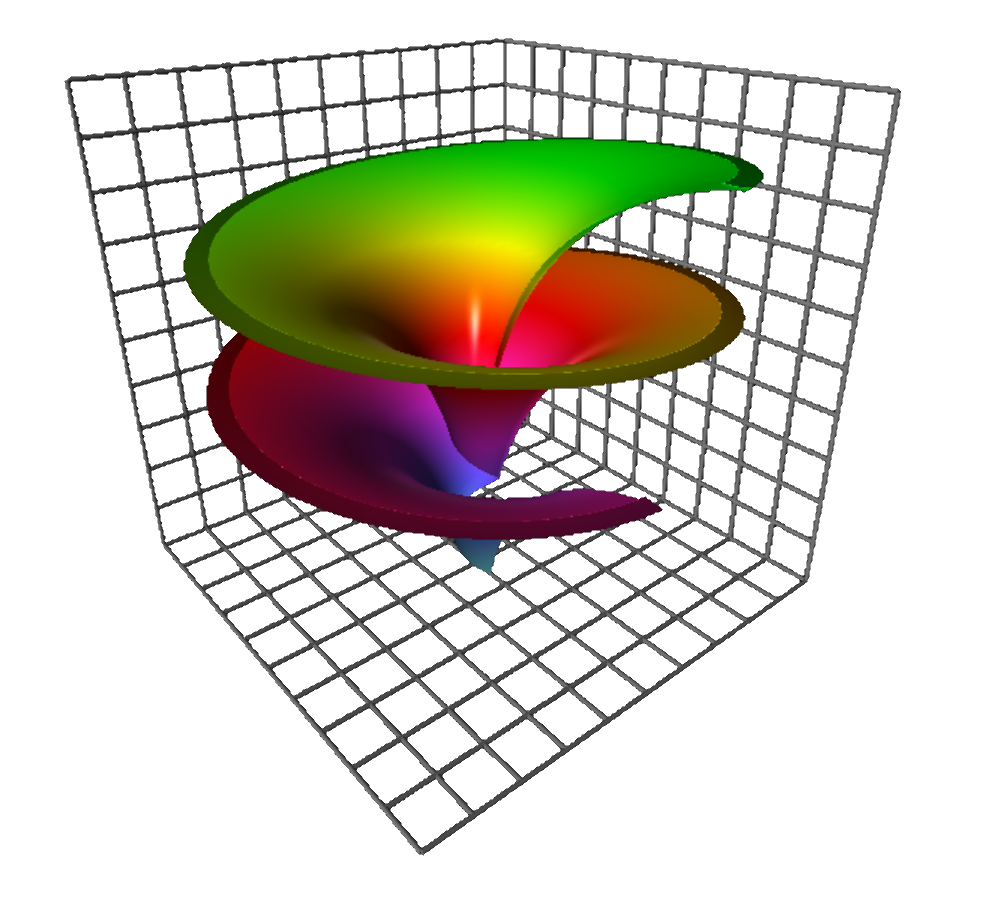
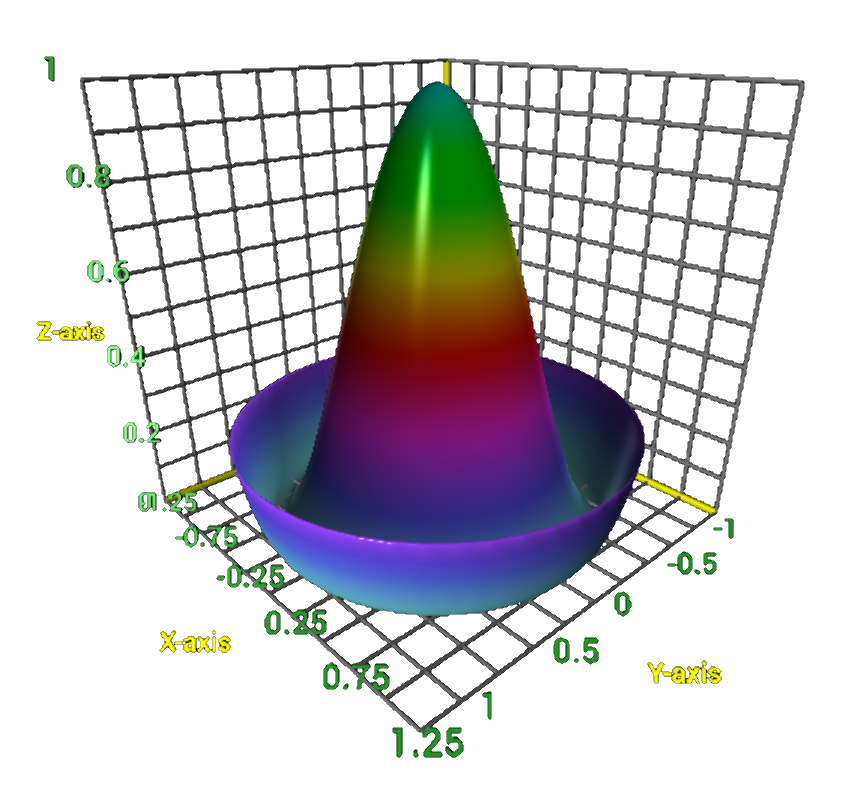
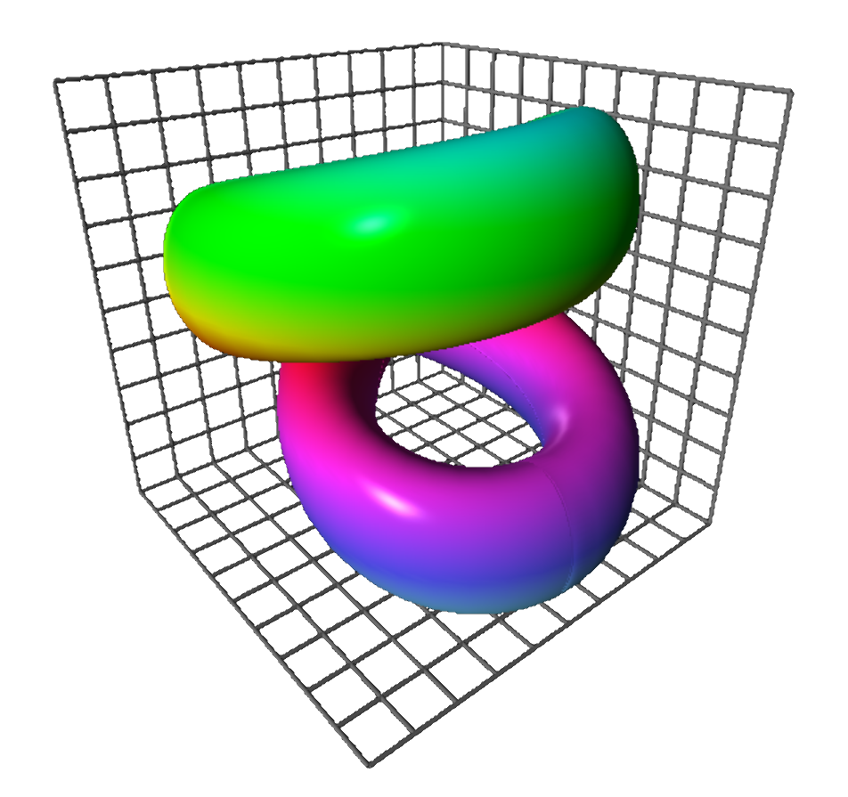
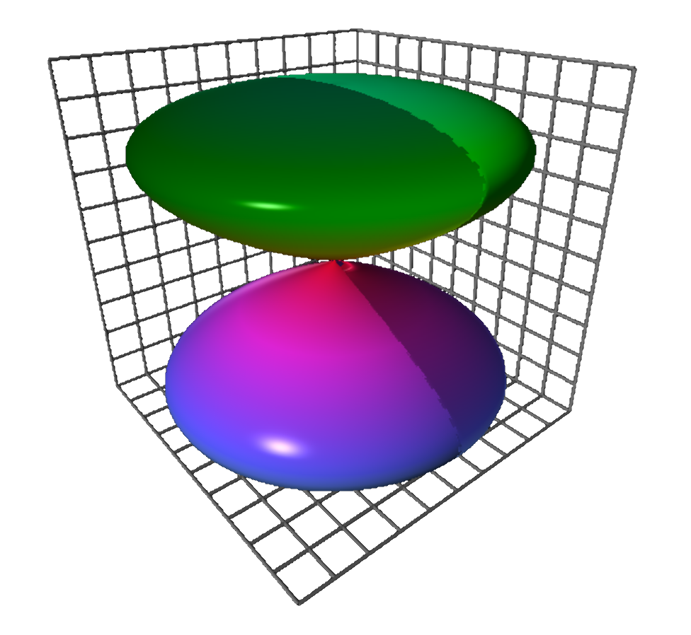

# Welcome to my math art gallery 

<figure style="float: left; width: 50%; text-align: center">
  
  <figcaption>Dini&apos;s spiral, Dini&apos;s surface, or twisted pseudo-sphere, which is characterized by a surface of constant (negative) curvature and is named after Ulisse Dini.</figcaption>
</figure>
<figure style="float: right; width: 50%; text-align: center">
  
  <figcaption>The so-called Mexican hat.</figcaption>
</figure>

 

<figure style="float: left; width: 50%; text-align: center">
  
  <figcaption>A twisted torus.</figcaption>
</figure>
<figure style="float: right; width: 50%; text-align: center">
  
  <figcaption>Lemniscate of Gerono, defined by $x4 - x2 + y2 + z2 = 0$.</figcaption>
</figure>

 

# References

- [Geometry, Surfaces, Curves, Polyhedra](https://paulbourke.net/geometry/) on 
  [Paul Bourke](https://paulbourke.net/geometry/)&apos; web site
- 