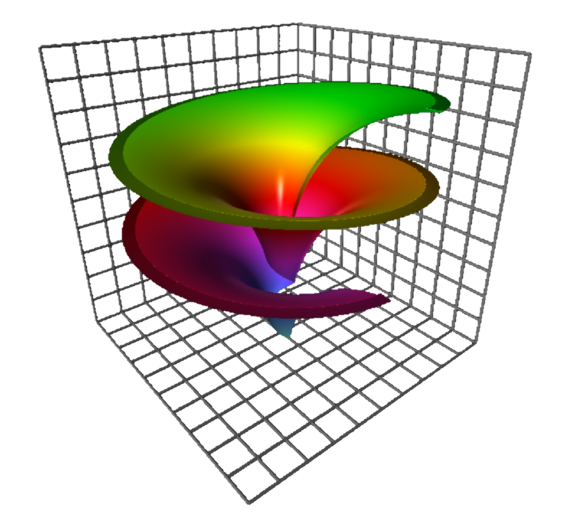
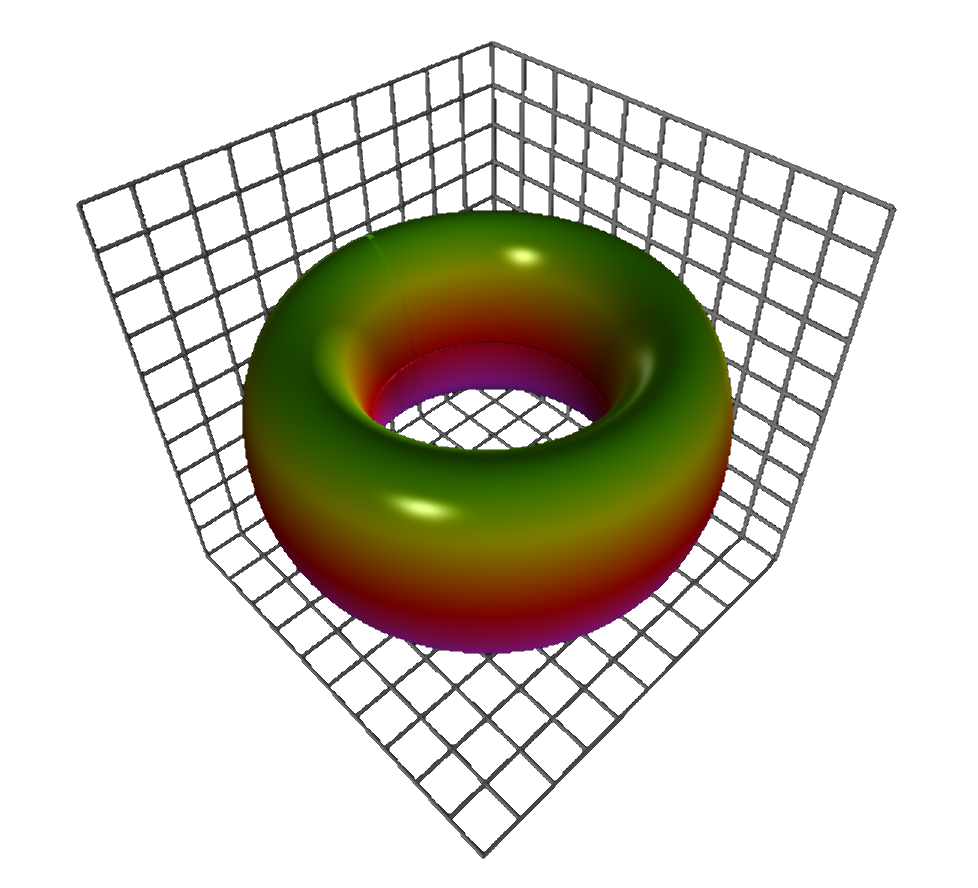
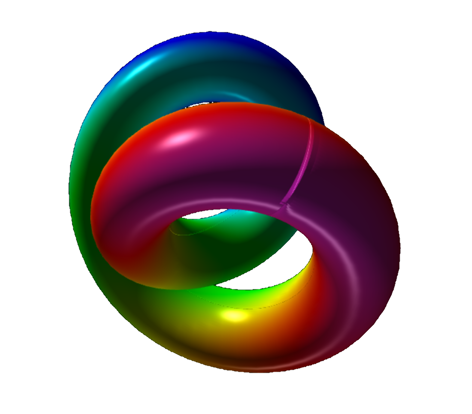
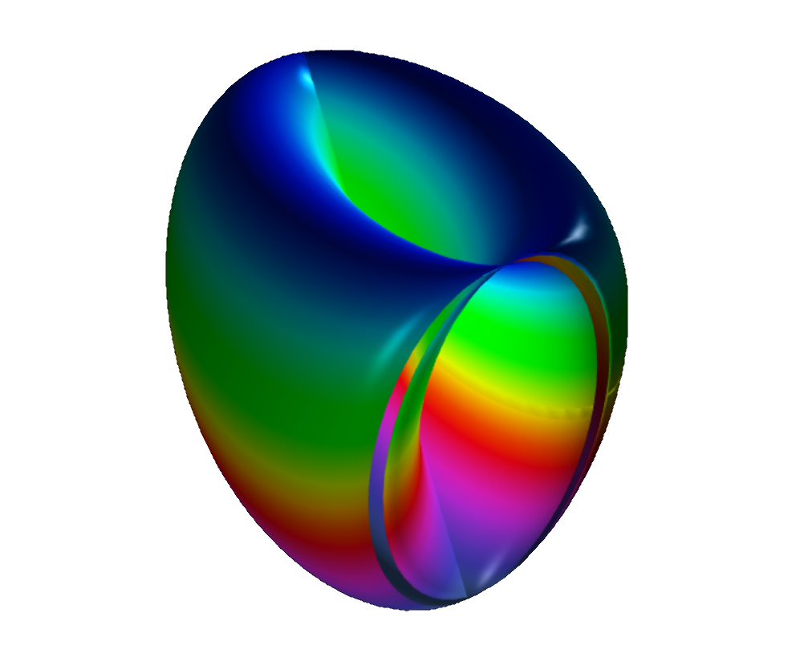

<blockquote>
Philosophy is written in this grand book &mdash; I mean universe &mdash; which stands continuously open to our gaze, 
but which cannot be understood unless one first learns to comprehend the language in which it is written. 
It is written in the language of mathematics, and its characters are triangles, circles and other geometric figures, 
without which it is humanly impossible to understand a single word of it; without these, one is wandering about 
in a dark labyrinth. &mdash; 
<a href="https://en.wikipedia.org/wiki/Galileo_Galilei">Galileo Galilei</a> (1623).
</blockquote>

 

# Welcome to my math art gallery 

<figure style="float: left; width: 50%; text-align: center">
  
  <figcaption>Dini&apos;s spiral, Dini&apos;s surface, or twisted pseudo-sphere, which is characterized by a surface of constant (negative) curvature and is named after Ulisse Dini.</figcaption>
</figure>
<figure style="float: right; width: 50%; text-align: center">
  
  <figcaption>Lemniscate of Gerono, defined by $x4 - x2 + y2 + z2 = 0$.</figcaption>
</figure>

<figure style="float: left; width: 50%; text-align: center">
  
  <figcaption>A torus.</figcaption>
</figure>
<figure style="float: right; width: 50%; text-align: center">
  
  <figcaption>A twisted torus.</figcaption>
</figure>

<figure style="float: left; width: 50%; text-align: center">
  
  <figcaption>A dented object.</figcaption>
</figure>
<figure style="float: right; width: 50%; text-align: center">
  
  <figcaption>The well-known Möbius strip.</figcaption>
</figure>

# References

- [Geometry, Surfaces, Curves, Polyhedra](https://paulbourke.net/geometry/) on 
  [Paul Bourke](https://paulbourke.net/geometry/)&apos; web site
- [Parametric plots](https://doc.sagemath.org/html/en/reference/plot3d/sage/plot/plot3d/parametric_plot3d.html)